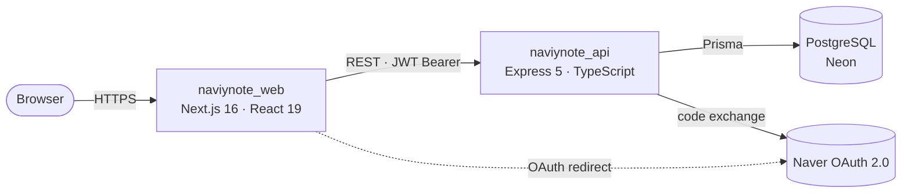

# NaviyNote API

<details>
<summary>🇰🇷 한국어로 보기</summary>

<br />

> **NaviyNote**의 전용 백엔드 API — 네이버 OAuth 기반 메모 & 할일 관리 서비스
> **Node.js · Express 5 · TypeScript · Prisma · PostgreSQL**

🚧 **현재 상태:** 초기 개발 단계. 네이버 OAuth + JWT 인증 및 Todo CRUD API 연동이 완료되었습니다. 메모, 대시보드, 통계, 네이버 캘린더 관련 엔드포인트는 추가 구현 예정입니다.

## 소개

**NaviyNote**는 네이버 OAuth 로그인을 기반으로 메모와 할 일을 1:1로 연결하고, 드래그 앤 드롭 및 통합 캘린더 뷰를 통해 효과적으로 일정을 관리할 수 있는 서비스입니다.

초기에는 하나의 Next.js 풀스택(Monolith) 앱으로 개발되었습니다. 이후 모던 클라이언트-서버 아키텍처로의 전환을 학습하기 위해, 기존 모놀리스 프로젝트를 프론트엔드 클라이언트와 전용 API 서버 두 개의 저장소로 분리하고 비즈니스 로직을 REST API 구조로 이관하고 있습니다.

이 저장소는 그중 **백엔드 API**입니다: 네이버 OAuth, JWT 발급/검증, Todo 도메인을 담당합니다.

## 관련 저장소

|     | 저장소                                                    | 설명                             |
| --- | --------------------------------------------------------- | -------------------------------- |
| 🖥️  | [NaviyNote_web](https://github.com/SJ-1220/NaviyNote_web) | 프론트엔드 클라이언트 (Next.js)  |
| ⚙️  | [NaviyNote_api](https://github.com/SJ-1220/NaviyNote_api) | 백엔드 API — **현재 저장소**     |
| 📦  | [NaviyNote](https://github.com/SJ-1220/NaviyNote)         | 분리 이전의 원본 풀스택 모놀리스 |

## 프로젝트 목적

새로운 제품을 만드는 것이 아닌, **아키텍처 개선을 목적으로 한 리팩토링 프로젝트**입니다. 완성되어 동작하는 모놀리스 앱을 분리(Decoupling)된 시스템으로 재구축합니다. 

이 과정에서 API 설계, 무상태(Stateless) JWT 인증, ORM 및 데이터베이스 마이그레이션 워크플로우, 계층형 모듈 구조 설계 등 풀스택 프레임워크 뒤에 가려져 있던 백엔드의 핵심 동작들을 직접 설계하고 제어해보는 것을 목표로 합니다.

## 기술 스택

| 영역 | 스택 |
| --- | --- |
| 런타임 | Node.js 24+, TypeScript (ESM) |
| 프레임워크 | Express 5 |
| ORM / DB | Prisma 7 · PostgreSQL (Neon) · `@prisma/adapter-pg` |
| 인증 | 네이버 OAuth 2.0 · `jsonwebtoken` · `cookie-parser` |
| 검증 | Zod (현재 환경변수 검증에 적용 완료, 요청 Body 검증 추가 예정) |
| HTTP 클라이언트 | `axios` |
| 도구 / 유틸 | `tsx` (Dev Watch) · `tsc` · `morgan` · `cors` |
| 제거 예정 | `@supabase/supabase-js` (기존 의존성 잔재, 미사용 중이며 완전 제거 예정) |

## 기능

### 제품 기능 (전체 시스템 관점)

- [x] 네이버 OAuth 2.0 로그인 / 로그아웃
- [x] JWT 액세스 + 리프레시 토큰, 자동 재발급
- [ ] Todo CRUD
  - [x] 날짜 · 기간 · 날짜없음 필터 목록 조회
  - [x] 개별 조회 / 생성 / 수정 / 삭제
  - [ ] 프론트엔드 연동 마무리
- [ ] 메모 CRUD
- [ ] 메모 4구역 자동 분류 + 드래그앤드롭 상태 변경
- [ ] 메모 ↔ Todo 1:1 연결
- [ ] 캘린더 뷰 + 날짜가 지정되지 않은 Todo를 드래그하여 일정 등록
- [ ] 메인 대시보드 (최근 메모 / ±5일 Todo / 중요 Todo)
- [ ] 통계
- [ ] 친구 기능
- [ ] 네이버 캘린더 일정 등록 연동

### 이 저장소 (백엔드 구현)

- [x] Express 5 + TypeScript(ESM) 서버 환경
- [x] Zod 기반 환경변수 검증
- [x] Prisma + PostgreSQL (Neon) 연동 및 DB 마이그레이션
- [x] 네이버 OAuth 콜백 / 토큰 교환 / 유저 Upsert 구현
- [x] JWT 발급 · 검증 미들웨어 · 토큰 재발급 · `/me` · 로그아웃 API 구현
- [x] Todo 모듈 (`routes → controller → service` 3계층) 및 CRUD/필터링 구현
- [ ] Zod 기반 요청 Body 검증 미들웨어 적용
- [ ] Repository 계층 분리
- [ ] Memo 모듈 및 Prisma 모델 정의
- [ ] 메인 / 통계 집계 엔드포인트
- [ ] 네이버 캘린더 일정 추가(add-schedule) 프록시 API 구현
- [ ] 전역 에러 핸들러 · 로깅 정리
- [ ] 테스트 (Vitest + supertest)
- [ ] 배포

## 아키텍처



## 프로젝트 구조

```
src/
├─ server.ts                 # 서버 엔트리포인트 (app.listen)
├─ app.ts                    # Express App 설정 (미들웨어 및 라우트 마운트)
├─ config/
│  ├─ env.ts                 # Zod 기반 환경변수 스키마 및 검증
│  └─ prisma.ts              # PrismaClient (pg 어댑터)
├─ middleware/
│  └─ authenticateUser.ts    # Bearer JWT 검증 → res.locals.userId
├─ modules/
│  ├─ auth/                  # 네이버 OAuth, JWT 발급/재발급, /me, 로그아웃
│  │  ├─ auth.routes.ts
│  │  ├─ auth.controller.ts
│  │  ├─ auth.service.ts
│  │  └─ auth.repository.ts  # Placeholder (구현 예정)
│  └─ todo/                  # Todo CRUD (routes → controller → service)
│     ├─ todo.routes.ts
│     ├─ todo.controller.ts
│     ├─ todo.service.ts
│     ├─ todo.types.ts
│     └─ todo.repository.ts  # Placeholder (구현 예정)
└─ generated/prisma/         # 생성된 Prisma 클라이언트 (gitignore)

prisma/
├─ schema.prisma             # User, Todo 모델
└─ migrations/
```

## 로컬 개발

### 사전 준비

- Node.js 24+
- PostgreSQL 데이터베이스 (본 프로젝트는 [Neon](https://neon.tech) 사용)
- [네이버 개발자센터](https://developers.naver.com) 애플리케이션 (Client ID / Secret)

### 환경 변수

`.env.example`을 `.env`로 복사한 뒤 값을 채웁니다.

| 변수명 | 필수 여부 | 기본값 | 설명 |
| --- | --- | --- | --- |
| `NODE_ENV` | 선택 | `development` | 실행 환경 (`development` / `production`) |
| `PORT` | 선택 | `8080` | HTTP 서버 포트 |
| `DATABASE_URL` | 필수 | — | PostgreSQL 연결 문자열 (Connection String) |
| `JWT_SECRET_KEY` | 필수 | — | Access Token 서명용 키 (만료 시간: 10분) |
| `JWT_REFRESH_SECRET_KEY` | 필수 | — | Refresh Token 서명용 키 (만료 시간: 14일) |
| `NAVER_CLIENT_ID` | 필수 | — | 네이버 OAuth Client ID |
| `NAVER_CLIENT_SECRET` | 필수 | — | 네이버 OAuth Client Secret |
| `NAVER_CALLBACK_URL` | 선택 | `http://localhost:3000/naver/callback` | OAuth `code`를 수신할 프론트엔드 콜백 URL |
| `SERVER_URL` | 선택 | `http://localhost:8080` | API 서버의 Public Base URL |

### 실행

```bash
npm install
cp .env.example .env          # 이후 값 채우기
npx prisma migrate dev        # 마이그레이션 적용 + 클라이언트 생성
npm run dev                   # http://localhost:8080  (tsx watch)
```

프로덕션 빌드:

```bash
npm run build && npm start
```

## API 레퍼런스

모든 응답은 JSON 형태이며, `{ success: true, ... }` 또는 `{ success: false, message: "..." }` 응답 포맷을 따릅니다.

### 인증 — `/api/auth`

| 메서드 | 경로 | 인증 여부 | 설명 |
| --- | --- | --- | --- |
| `GET` | `/naver` | — | 네이버 로그인 인가 URL로 리다이렉트 및 CSRF 방지용 `naver_state` 쿠키 발급 |
| `POST` | `/naver/callback` | — | 수신한 `{ code, state }`를 토큰으로 교환, 유저 정보 Upsert, `accessToken` 반환 및 `refresh_token` 쿠키 설정 |
| `POST` | `/token/refresh` | Refresh 쿠키 | `refresh_token` 쿠키를 검증하여 새로운 `accessToken` 발급 |
| `GET` | `/me` | Bearer Token | 현재 로그인된 유저 프로필 조회 |
| `POST` | `/naver/logout` | — | `refresh_token` 쿠키 삭제 및 로그아웃 처리 |

### Todo — `/api/todo`

모든 엔드포인트는 `Authorization: Bearer <accessToken>` 헤더가 필수이며, 해당 토큰의 소유자 데이터로 제한(Scoped)됩니다.

| 메서드 | 경로 | 설명 |
| --- | --- | --- |
| `GET` | `/` | 로그인된 유저의 Todo 목록 조회 (`date` 오름차순). 상호 배타적 쿼리 파라미터 지원: `?date=YYYY-MM-DD`, `?start=YYYY-MM-DD&end=YYYY-MM-DD`, `?noDate=true` |
| `GET` | `/:id` | 단건 Todo 조회 (본인 소유가 아닌 경우 `404` 반환) |
| `POST` | `/` | Todo 생성. Request Body: `{ task, date?, important?, completed?, memoId? }` |
| `PATCH` | `/:id` | Todo 부분 수정: `{ task?, completed?, important?, date?, memoId? }` |
| `DELETE` | `/:id` | Todo 삭제 (본인 소유가 아닌 경우 `404` 반환) |

> `GET /` (루트) 경로 호출 시 단순 Health Check 문자열을 반환합니다. `GET /test/middleware` 경로는 미들웨어 테스트용 라우트이며 추후 제거될 예정입니다.

## 모놀리스 대비 변경점

| 항목 | NaviyNote (기존 모놀리스) | naviynote_api (현재 백엔드) |
| --- | --- | --- |
| 역할 및 구조 | 풀스택 앱 내의 Next.js API Routes | 독립적으로 실행되는 Express 기반 전용 백엔드 서비스 |
| 데이터 접근 | `src/services/*` 내 Supabase 클라이언트 직접 호출 | Prisma ORM 및 명시적인 `modules/<domain>` 계층 구조 적용 |
| 인증 방식 | `next-auth` 세션 기반 | 자체 JWT Access/Refresh Token 발급 및 미들웨어 검증 |
| 데이터베이스 | Supabase Postgres | Neon Postgres + Prisma Migration을 통한 스키마 관리 |
| 아키텍처 경계 | UI와 동일한 Origin | 독립된 프론트엔드에서 호출하는 CORS 적용 REST API |

</details>

---

> Decoupled backend for **NaviyNote** — a Naver-OAuth memo & todo manager.
> **Node.js · Express 5 · TypeScript · Prisma · PostgreSQL**

🚧 **Status:** Early development. Naver OAuth + JWT auth and the full Todo CRUD API are working. Memo, dashboard, statistics, and Naver Calendar endpoints are not implemented yet.

## About

**NaviyNote** is a memo & schedule manager built around Naver OAuth login, letting users
link todos and memos 1:1 and manage them through drag-and-drop and a unified calendar view.

It was originally shipped as a single Next.js full-stack app. To practice modern
client–server architecture, that monolith is being split into two repositories — a
frontend client and this dedicated API server — and its business logic ported to REST.

This repository is the **backend API**: Naver OAuth, JWT issuance/verification, and the
Todo domain.

## Related repositories

|     | Repository                                                | Description                                         |
| --- | --------------------------------------------------------- | --------------------------------------------------- |
| 🖥️  | [NaviyNote_web](https://github.com/SJ-1220/NaviyNote_web) | Frontend client (Next.js)                           |
| ⚙️  | [NaviyNote_api](https://github.com/SJ-1220/NaviyNote_api) | Backend API — **this repo**                         |
| 📦  | [NaviyNote](https://github.com/SJ-1220/NaviyNote)         | Original full-stack monolith this project decouples |

## Why this project

The goal is not a new product but a deliberate re-architecture exercise: take a finished,
working monolith and rebuild it as a decoupled system to get hands-on with API design,
stateless JWT auth, an ORM + migration workflow, and layered module structure — the parts
a full-stack framework otherwise hides.

## Tech Stack

| Area            | Stack                                                                            |
| --------------- | -------------------------------------------------------------------------------- |
| Runtime         | Node.js 24+, TypeScript (ESM)                                                    |
| Framework       | Express 5                                                                        |
| ORM / DB        | Prisma 7 · PostgreSQL (Neon) · `@prisma/adapter-pg`                              |
| Auth            | Naver OAuth 2.0 · `jsonwebtoken` · `cookie-parser`                               |
| Validation      | Zod (env config today; request-body validation planned)                          |
| HTTP client     | `axios`                                                                          |
| Tooling         | `tsx` (dev watch), `tsc`, `morgan`, `cors`                                       |
| Pending cleanup | `@supabase/supabase-js` — still in dependencies, currently unused, to be removed |

## Features

### Product features (whole system)

- [x] Naver OAuth 2.0 login / logout
- [x] JWT access + refresh tokens with automatic re-issue
- [ ] Todo CRUD
  - [x] List with date / range / no-date filters
  - [x] Get one / create / update / delete
  - [ ] Frontend wiring complete
- [ ] Memo CRUD
- [ ] Memo auto-sorting into 4 quadrants + drag-and-drop state changes
- [ ] Memo ↔ Todo 1:1 linking
- [ ] Calendar view + drag a date-less todo onto a day to schedule it
- [ ] Main dashboard (recent memos / ±5-day todos / important todos)
- [ ] Statistics
- [ ] Friends
- [ ] Naver Calendar schedule registration

### This repository (backend)

- [x] Express 5 + TypeScript (ESM) server setup
- [x] Zod-validated environment config
- [x] Prisma + PostgreSQL (Neon) with migrations
- [x] Naver OAuth callback / token exchange / user upsert
- [x] JWT issue · verification middleware · refresh · `/me` · logout
- [x] Todo module (`routes → controller → service`), CRUD + filters
- [ ] Request-body validation with Zod
- [ ] Repository layer extraction
- [ ] Memo module + Prisma model
- [ ] Main / statistics aggregation endpoints
- [ ] Naver Calendar add-schedule proxy
- [ ] Global error handler · logging cleanup
- [ ] Tests (Vitest + supertest)
- [ ] Deployment

## Architecture


## Project Structure

```
src/
├─ server.ts                 # entrypoint (app.listen)
├─ app.ts                    # express app: middleware + route mounting
├─ config/
│  ├─ env.ts                 # Zod-validated environment config
│  └─ prisma.ts              # PrismaClient (pg adapter)
├─ middleware/
│  └─ authenticateUser.ts    # Bearer JWT verification → res.locals.userId
├─ modules/
│  ├─ auth/                  # Naver OAuth, JWT issue/refresh, /me, logout
│  │  ├─ auth.routes.ts
│  │  ├─ auth.controller.ts
│  │  ├─ auth.service.ts
│  │  └─ auth.repository.ts  # placeholder — not used yet
│  └─ todo/                  # Todo CRUD (routes → controller → service)
│     ├─ todo.routes.ts
│     ├─ todo.controller.ts
│     ├─ todo.service.ts
│     ├─ todo.types.ts
│     └─ todo.repository.ts  # placeholder — not used yet
└─ generated/prisma/         # generated Prisma client (gitignored)

prisma/
├─ schema.prisma             # User, Todo models
└─ migrations/
```

## Local Development

### Prerequisites

- Node.js 24+
- A PostgreSQL database (this project uses [Neon](https://neon.tech))
- A [Naver Developers](https://developers.naver.com) application (Client ID / Secret)

### Environment variables

Copy `.env.example` to `.env` and fill in the values.

| Variable                 | Required | Default                                | Description                                   |
| ------------------------ | :------: | -------------------------------------- | --------------------------------------------- |
| `NODE_ENV`               |    no    | `development`                          | Runtime environment                           |
| `PORT`                   |    no    | `8080`                                 | HTTP port                                     |
| `DATABASE_URL`           | **yes**  | —                                      | PostgreSQL connection string                  |
| `JWT_SECRET_KEY`         | **yes**  | —                                      | Signing key for access tokens (10-minute TTL) |
| `JWT_REFRESH_SECRET_KEY` | **yes**  | —                                      | Signing key for refresh tokens (14-day TTL)   |
| `NAVER_CLIENT_ID`        | **yes**  | —                                      | Naver OAuth application client ID             |
| `NAVER_CLIENT_SECRET`    | **yes**  | —                                      | Naver OAuth application client secret         |
| `NAVER_CALLBACK_URL`     |    no    | `http://localhost:3000/naver/callback` | Frontend route that receives the OAuth `code` |
| `SERVER_URL`             |    no    | `http://localhost:8080`                | Public base URL of this API                   |

### Run

```bash
npm install
cp .env.example .env          # then fill in the values
npx prisma migrate dev        # apply migrations + generate client
npm run dev                   # http://localhost:8080  (tsx watch)
```

Production build:

```bash
npm run build && npm start
```

## API Reference

All responses are JSON, shaped as `{ success: true, ... }` or `{ success: false, message }`.

### Auth — `/api/auth`

| Method | Path              | Auth           | Description                                                                                                        |
| ------ | ----------------- | -------------- | ------------------------------------------------------------------------------------------------------------------ |
| `GET`  | `/naver`          | —              | Redirect to the Naver authorize URL; sets a `naver_state` cookie (CSRF)                                            |
| `POST` | `/naver/callback` | —              | Exchange `{ code, state }` for tokens; upserts the user; returns `accessToken` and sets the `refresh_token` cookie |
| `POST` | `/token/refresh`  | refresh cookie | Issue a new `accessToken` from the `refresh_token` cookie                                                          |
| `GET`  | `/me`             | Bearer         | Current user's profile                                                                                             |
| `POST` | `/naver/logout`   | —              | Clear the `refresh_token` cookie                                                                                   |

### Todo — `/api/todo`

All endpoints require `Authorization: Bearer <accessToken>` and are scoped to the token's user.

| Method   | Path   | Description                                                                                                                                            |
| -------- | ------ | ------------------------------------------------------------------------------------------------------------------------------------------------------ |
| `GET`    | `/`    | List the user's todos (`date` ascending). Optional, mutually exclusive filters: `?date=YYYY-MM-DD`, `?start=YYYY-MM-DD&end=YYYY-MM-DD`, `?noDate=true` |
| `GET`    | `/:id` | Single todo — `404` if not owned by the caller                                                                                                         |
| `POST`   | `/`    | Create. Body: `{ task, date?, important?, completed?, memoId? }`                                                                                       |
| `PATCH`  | `/:id` | Partial update: `{ task?, completed?, important?, date?, memoId? }`                                                                                    |
| `DELETE` | `/:id` | Delete — `404` if not owned by the caller                                                                                                              |

> `GET /` (root) returns a plain health string. `GET /test/middleware` is a temporary
> auth-check route and will be removed.

## Differences from the monolith

| Concern     | NaviyNote (monolith)                         | naviynote_api                                                  |
| ----------- | -------------------------------------------- | -------------------------------------------------------------- |
| Role        | Next.js API routes inside the full-stack app | Standalone Express service                                     |
| Data access | Supabase client in `src/services/*`          | Prisma ORM with explicit `modules/<domain>` layering           |
| Auth        | next-auth session                            | Issues its own JWT access/refresh pair, verified by middleware |
| Database    | Supabase Postgres                            | Neon Postgres with Prisma migrations                           |
| Boundary    | Same origin as the UI                        | CORS-scoped API consumed by a separate frontend                |
